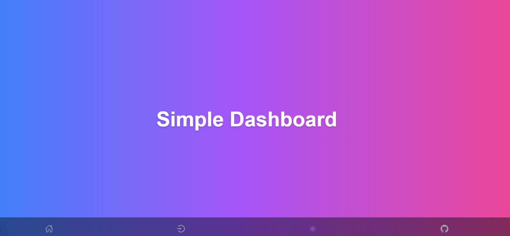
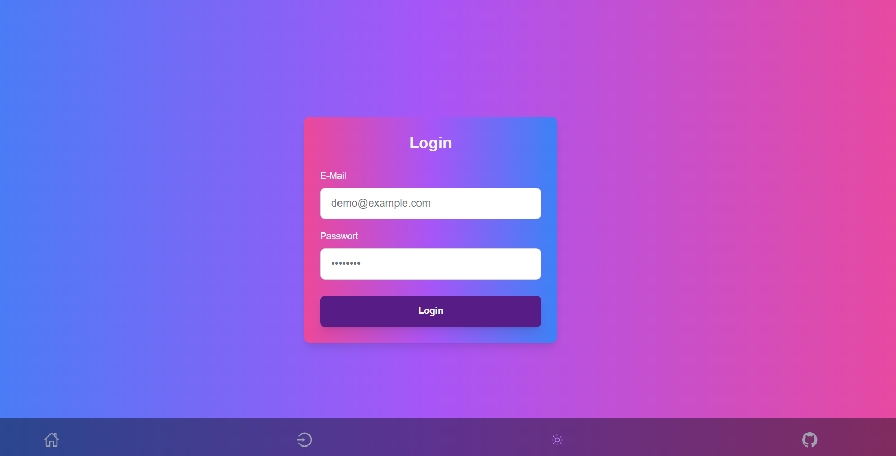
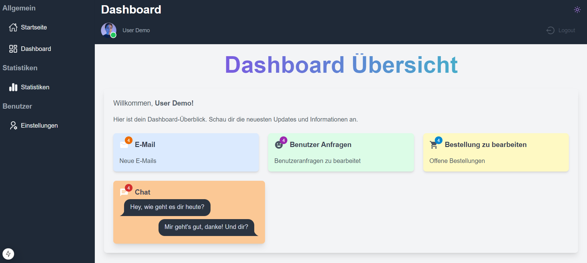
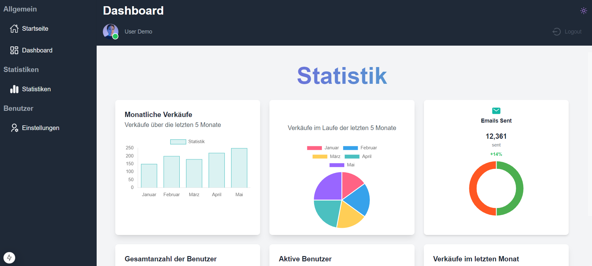
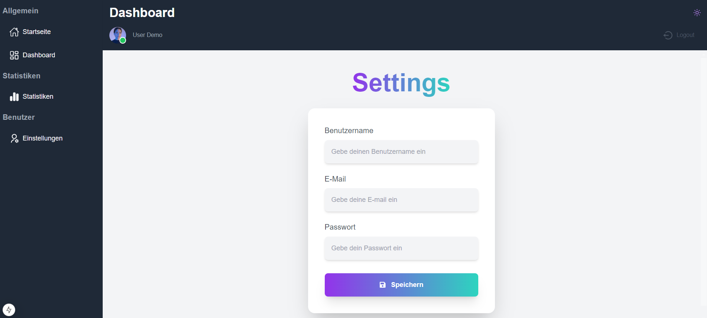

# Simply-Dashboard

Ein modernes, einfaches Dashboard-Projekt mit **Next.js 15** und der neuen **App Router**-Architektur. Perfekt für intuitive Dashboards mit optimierten und modularen Komponenten.

## 📸 Screenshots

### 🌟 App-Hauptseite (Light Mode)
Zeigt die Einstiegsseite der App mit ihrem minimalistischen und modernen Design.



---

### 🔐 Login-Seite (Light Mode)
Das Login-Formular, gestaltet für eine einfache und ansprechende Anmeldung.



---

### 📊 Dashboard-Ansicht (Light Mode)
Ein Überblick über das Dashboard mit dynamischen Widgets und Datenvisualisierungen.

#### Übersicht


#### Statistik-Widgets
Zeigt Diagramme und Metriken in Echtzeit.



#### Einstellungen
Anpassungsoptionen für Benutzer.



## 🌐 Live-Demo

Sieh dir die **Live-Demo** des Projekts an:

[Simply-Dashboard Live-Demo](https://simply-dashboard-v1.vercel.app/)


## 🚀 Features

- **Next.js 15 App Router**: Die neueste Version von Next.js mit verbesserter Struktur und Serverkomponenten.
- **Material-UI & TailwindCSS**: Kombination von Utility-first CSS und anpassbaren UI-Komponenten.
- **Interaktive Diagramme**: Dank **Chart.js** und **react-chartjs-2**.
- **Reibungslose Animationen**: Mit **AOS** für Scroll-Effekte.
- **DaisyUI Themes**: Unterstützung für **Light**, **Dark** und **Synthwave**.
- **Dark-/Light-Mode-Switch**: Speichert Benutzerpräferenzen.
- **Benutzerfreundliche Benachrichtigungen**: Mit **React Toastify**.

## 📂 Projektstruktur

```bash
📦 Simply-Dashboard-1.0
├── 📁 .next             # Vom Build generierte Dateien
├── 📁 node_modules      # Abhängigkeiten
├── 📁 public            # Statische Dateien (Bilder, Fonts, Icons)
├── 📁 src
│   ├── 📁 app           # Hauptstruktur der App
│   │   ├── 📁 about     # Info-Seite
│   │   ├── 📁 dashboard # Dashboard-Seite
│   │   ├── 📁 login     # Login-Seite
│   │   └── 📄 layout.js # Globale Layout-Datei
│   │   └── 📄 page.js   # Einstiegsseite
│   ├── 📁 components    # Wiederverwendbare UI-Komponenten
│   ├── 📁 data          # Beispiel-Daten oder APIs
│   ├── 📁 fonts         # Schriftarten
│   └── 📄 globals.css   # Globale Styles
├── 📄 jsconfig.json      # JavaScript-Konfiguration
├── 📄 next.config.mjs    # Next.js-Konfigurationsdatei
├── 📄 package.json       # Projekt- und Abhängigkeitsverwaltung
└── 📄 .gitignore         # Dateien, die von Git ignoriert werden
```

## 🛠️ Installation und Nutzung

1. **Abhängigkeiten installieren**:
   ```bash
   npm install
   ```

2. **Entwicklungsserver starten**:
   ```bash
   npm run dev
   ```

3. **Anwendung öffnen**:
   Im Browser zu `http://localhost:3000` navigieren.

## 🎨 Styling und Themes

Das Projekt nutzt **TailwindCSS** und **DaisyUI** für effizientes Styling und bietet eine Auswahl an Themes, die leicht gewechselt werden können. Benutzer können zwischen **Light**, **Dark** und **Synthwave** umschalten, wobei die Präferenz gespeichert wird.

- **Dynamisches Umschalten**: Der Dark-/Light-Mode-Switch aktualisiert die UI in Echtzeit.
- **Vorkonfigurierte Themes**: Direkt einsatzbereit, ohne zusätzliche Anpassungen.

## 📊 Funktionen und Komponenten

### Dashboard-Seite
- **Dynamische Widgets**: Interaktive Diagramme und Karten mit **Chart.js**.
- **Profile und Benutzerverwaltung**: Minimalistischer Avatar für Benutzeridentifikation.
- **Scroll-Animationen**: Verbesserte Nutzererfahrung durch sanfte Animationen mit **AOS**.

### Login-Seite
- Einfaches Formular für die Benutzeranmeldung mit responsivem Design und Dummy-Daten für eine schnelle Demo.

### Globale Layouts
- Einheitliches Layout für konsistente Navigation und Styling.

## 📚 Verwendete Technologien

- **Next.js** (15.0.3) mit App Router
- **React** (18.3.1)
- **TailwindCSS** (3.4.1)
- **DaisyUI** (4.12.14)
- **Material-UI** (6.1.8)
- **Chart.js** (4.4.6)

Dein Ansatz mit den Bildern ist bereits gut durchdacht! Damit die Darstellung in der README sauber und strukturiert wirkt, kannst du die Abschnitte leicht verbessern, indem du etwas Kontext oder Unterüberschriften hinzufügst. Hier ist eine optimierte Version:

